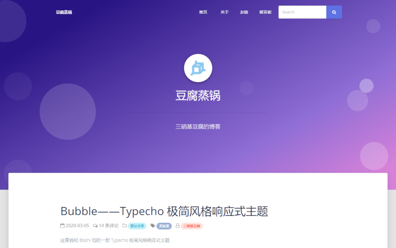

# Bubble

一块豆腐和一头进了信息学算法竞赛中国集训队的🐷写的 Typecho 极简风格响应式主题。

Demo:  [豆腐的 Blog](https://tntofu.com/)

PS:

🐷~~由于有些特殊的需求所以~~在本主题代码上进行了部分修改，属于不同版本，你可以根据个人喜好选择

+ Github reop: [https://github.com/totorato/Bubble](https://github.com/totorato/Bubble)
+ Demo: [🐷的 Blog](http://www.whalemaid.xyz/)

# 特性

+ 我们自己觉得挺好看的
+ 支持添加自定义 css
+ 添加文章/页面修改按钮~~妈妈再也不用担心我改文章得找半天了~~
+ 两个作者**都**不会 css 也不会 html 更不会 php（Bug 有没有不知道，欢迎提交 issue）
+ ~~🐷：提供强大的算法支持（搞笑的）~~

# 使用

+ 直接下载 zip 源码，解压后修改文件夹名称，移动到 Typecho 主题目录，也可以直接在服务器上用 git clone 下载主题
+ 可在 Typecho 后台->控制台->外观->设置外观中设置主题相应功能，如站点图标
+ 你可以添加自定义样式：通过 Typecho 后台修改 `style.css` 即可（默认为空文件，若后台显示文件不可修改请注意站点目录权限设置）

# 截图

# License

Open sourced under the MIT license.

# 其他

+ 基于[Argon Design System](https://www.creative-tim.com/product/argon-design-system)
+ 评论模块中部分代码参照了 Typecho 官方主题 Default

# Todo

+ 页脚显示“最新评论”、“最新文章”和“文章归档”
+ 顶部增加 Wordpress 式顶栏，方便操作
+ 支持自定义首页背景图像和其他页面标题栏背景图像

# 更新历史
## 2.0

+ 采用卡片式页面，提升美观性
+ 美化顶部导航栏样式
+ 新增后台设置 Logo 和 首页头像功能
+ 美化文章列表和文章阅读页中文章状态标签（如分类、作者等）
+ 美化评论区显示，添加博主标志，调整头像大小，提升布局美观性，解决评论卡片无法显示于子评论下方的问题，适配移动端，提升阅读舒适度
+ 采用 font awesome 代替 nucleo 图标集，丰富图标种类
+ 美化加密文章密码表单
+ 调整隐藏/加密文章的评论卡显示机制
+ 调整页面 title 显示机制

## 2.0 之前

我不记得了，也懒得看
